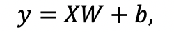
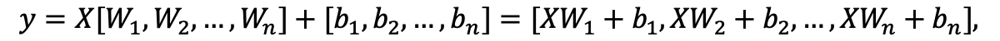
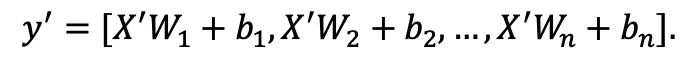
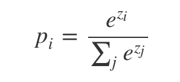

# PLSC: 飞桨大规模分类库

## 简介
深度学习中用于解决多分类问题的深度神经网络的最后一层通常是全连接层和Softmax的组合层，并采用交叉熵(Cross-Entropy)算法计算神经网络的损失函数。由于全连接层的参数量随着分类类别数的增长线性增长，当分类类别数相当大时，神经网络的训练会面临下面两个主要挑战：

1. 参数量过大，超出单个GPU卡的显存容量：假设分类网络最后一层隐层的输出维度为512，那么当分类类别数为一百万时，最后一层全连接层参数的大小约为2GB（假设以32比特浮点数表示参数）。当分类问题的类别数为一亿时（例如，对自然界中的生物进行分类），则最后一层全连接层参数的大小接近200GB，远远超过当前GPU的显存容量。

2. 参数量较大，同步训练方式下通信开销较大：数据并行训练方式下，所有GPU卡之间需要同步参数的梯度信息，以完成参数值的同步更新。当参数数量较大时，参数的梯度信息数据量同样较大，从而导致参数梯度信息的通信开销较大，影响训练速度。

飞桨大规模分类(PLSC: **P**addlePaddle **L**arge **S**cale **C**lassification)库是基于[飞桨平台](https://github.com/PaddlePaddle/Paddle)构建的超大规模分类库，为用户提供从训练到部署的大规模分类问题全流程解决方案。

## PLSC特性
* 支持超大规模分类：单机8张V100 GPU配置下支持的最大类别数扩大2.52倍，支持的类别数随GPU卡数的增加而增加；
* 训练速度快：单机8张V100 GPU配置下，基于ResNet50模型的百万类别分类训练速度2,122.56 images/s, 并支持多机分布式训练和混合精度训练;
* 支持训练训练卡数的调整：加载模型参数的热启动训练可以使用和预训练不同的GPU卡数，并自动进行参数转换；
* base64格式图像数据预处理：提供base64格式图像数据的预处理，包括数据的全局shuffle，数据自动切分；
* 全流程解决方案：提供从训练到部署的大规模分类问题全流程解决方案。

## 文档目录
* [快速入门](#快速入门)
    * [安装说明](#安装说明)
    * [训练和验证](#训练和验证)
    * [API介绍](#API介绍)
* [预测部署](#预测部署)
    * [预测模型导出](#预测模型导出)
    * [预测库使用指南](#预测库使用指南)
* [高级功能](#高级功能)
    * [模型参数上传和下载(HDFS)](#模型参数上传和下载(HDFS))
    * [Base64格式图像数据预处理](#Base64格式图像数据预处理)
    * [混合精度训练](#混合精度训练)
    * [分布式参数转换](#分布式参数转换)
* [设计思想](#设计思想)
    * [显存优化](#显存优化)
    * [通信优化](#通信优化)

## 快速入门
### 安装说明
Python版本要求：
* python 2.7+
#### 1. 安装PaddlePaddle
##### 1.1 版本要求：
* PaddlePaddle>= 1.6.2或开发版

##### 1.2 pip安装

当前，需要在GPU版本的PaddlePaddle下使用大规模分类库。

```shell
pip install paddlepaddle-gpu
```

关于PaddlePaddle对操作系统、CUDA、cuDNN等软件版本的兼容信息，以及更多PaddlePaddle的安装说明，请参考[PaddlePaddle安装说明](https://www.paddlepaddle.org.cn/documentation/docs/zh/beginners_guide/install/index_cn.html)

#### 2. 安装依赖包

```shell
pip install -r requirements.txt
```
直接使用requirement.txt安装依赖包默认会安装最新的稳定版本PaddlePaddle。如需要使用开发版本的PaddlePaddle，请先通过下面的命令行卸载已安装的PaddlePaddle，并重新安装开发版本的PaddlePaddle。关于如何安装获取开发版本的PaddlePaddle，请参考[多版本whl包列表](https://www.paddlepaddle.org.cn/documentation/docs/zh/beginners_guide/install/Tables.html#ciwhls)

```shell
pip uninstall paddlepaddle-gpu
```

#### 3. 安装PLSC大规模分类库

```shell
pip install plsc
```

### 训练和验证
### API介绍

## 预测部署
### 预测模型导出
### 预测库使用指南

## 高级功能
### 模型参数上传和下载(HDFS)
### Base64格式图像数据预处理
### 混合精度训练
### 分布式参数转换

## 设计思想

解决大规模分类问题的核心思想是采用模型并行方案实现深度神经网络模型的全连接层以及之后的损失值计算。

首先，我们回顾大规模分类问题面临的两个主要挑战：

1. 参数量过大，超出单个GPU卡的显存容量

2. 参数量较大，同步训练方式下通信开销较大

### 显存优化

为了解决显存不足的问题，PLSC采用模型并行设计，将深度神经网络的最后一层全连接层切分到各个GPU卡。全连接层天然地具有可切分属性，无外乎是一个矩阵乘法和加法（存在偏置项的情形下）。假设以100张GPU卡进行模型训练，当分类类别数目为一亿时，每张GPU卡上的全连接参数的大小约为2GB，这完全是可接受的。

对于全连接层计算，可以表示为矩阵乘法和加法，如下面的公示所示：



其中，*W*和*b*全连接层参数，*X*是神经网络最后一层隐层的输出。将根据矩阵分块原理，全连接层计算又可以进一步地表示为下面的形式：



这里，*n*是分块的块数。因此，我们可以将神经网络的最后一层全连接参数分布到多张GPU卡，并在每张卡上分别完成全连接层的部分计算，从而实现整个全连接层的计算，并解决大规模分类问题面临的GPU显存空间不足的问题。

需要注意的是，由于将神经网络模型最后一层全连接层参数划分到多张GPU卡，因此需要汇总各个GPU上的*X*参数，得到全连接层的全局输入*X*’(可以通过集合通信allgather实现)，并计算全连接层输出:



### 通信优化

为了得到多分类任务的损失值，在完成全连接层计算后，通常会使用Softmax+交叉熵操作。

softmax的计算公示如下图所示：



由于softmax计算是基于全类别的logit值的，因此需要进行全局同步，以计算分母项。这需要执行*N*次AllGather操作，这里*N*是参与训练的GPU卡数。这种全局通信方式的开销较大。

为了减少通信和计算代价，PLSC实现中仅同步其中的分母项。由于各个GPU卡上分母项是一个标量，所以可以显著降低通信开销。

## PLSC的特征：

- 基于源于产业实践的开源深度学习平台[飞桨平台](https://www.paddlepaddle.org.cn)

  飞桨是由百度研发的一款源于产业实践的开源深度学习平台，致力于让深度学习技术的创新与应用更简单。PLSC基于飞桨平台研发，实现与飞桨平台的无缝链接，可以更好地服务产业实践。

- 支持大规模分类

  单机8张V100 GPU配置下，支持的分类类别数增大了2.52倍;

- 包含多种预训练模型

  除了PLSC库源码，我们还发布了基于ResNet50模型、ResNet101模型、ResNet152模型的大规模分类模型在多种数据集上的预训练模型，方便用户基于这些预训练模型进行下游任务的fine-tuning。

- 提供从训练到部署的全流程解决方案

  PLSC库功能包括数据预处理、模型训练、验证和在线预测服务，提供从训练到部署的大规模分类问题全流程解决方案，用户可以基于PLSC库快速、便捷地搭建大规模分类问题解决方案。

## 预训练模型和性能

### 预训练模型

我们提供了下面的预训练模型，以帮助用户对下游任务进行fine-tuning。

| 模型             | 描述           |
| :--------------- | :------------- |
| [resnet50_distarcface_ms1m_arcface](https://plsc.bj.bcebos.com/pretrained_model/resnet50_distarcface_ms1mv2.tar.gz) | 该模型使用ResNet50网络训练，数据集为MS1M-ArcFace，训练阶段使用的loss_type为'dist_arcface'，预训练模型在lfw验证集上的验证精度为0.99817。 | 

### 训练性能

| 模型             | 训练集   | lfw  | agendb_30 | cfp_ff | cfp_fp |
| :--------------- | :------------- | :------ | :----- | :------ | :----  |
| ResNet50 | MS1M-ArcFace | 0.99817 | 0.99827 | 0.99857 | 0.96314 |
| ResNet50 | CASIA | 0.9895 | 0.9095 | 0.99057 | 0.915 |

备注：上述模型训练使用的loss_type为'dist_arcface'。更多关于ArcFace的内容请参考[ArcFace: Additive Angular Margin Loss for Deep Face Recognition](https://arxiv.org/abs/1801.07698)

## 使用教程

我们提供了一系列使用教程，来帮助用户完成使用PLSC大规模分类库进行训练、评估和部署。

这一系列文档分为**快速入门**、**基础功能**、**预测部署**和**高级功能**四个部分，由浅入深地介绍PLSC大规模分类库的使用方法。

### 快速入门

* [训练和验证](docs/usage.md)

### 基础功能

* [API简介](docs/api_intro.md)
* [自定义模型](docs/custom_models.md)

### 预测部署

* [模型导出](docs/export_for_infer.md)
* [C++预测库使用](docs/serving.md)

### 高级功能

* [分布式参数转换](docs/distributed_params.md)
* [Base64格式图像预处理](docs/base64_preprocessor.md)

* 2019.12.23
  **`0.1.0`**
  *PaddlePaddle大规模分类库（PLSC）发布，内建ResNet50、ResNet101和ResNet152三种模型，并支持自定义模型;
  * 单机8张V100 GPU配置下，ResNet50模型一百万类别训练速度2,122.56 images/s, 并支持多机分布式训练;
  * 发布模型在线预测库;
  * 发布基于ResNet50网络和MS1M-ArcFace数据集的预训练模型。
