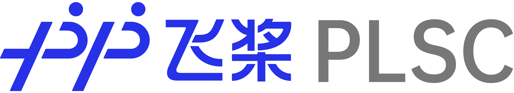

<p align="center">
  
</p>

------------------------------------------------------------------------------------------

<p align="center">
    <a href="./LICENSE"></a>
    <a href="https://github.com/PaddlePaddle/PLSC/releases"></a>
    <a href=""></a>
    <a href="https://github.com/PaddlePaddle/PLSC/graphs/contributors"></a>
    <a href="https://github.com/PaddlePaddle/PLSC/issues"></a>
    <a href="https://github.com/PaddlePaddle/PLSC/stargazers"></a>
</p>

## Introduction

[PLSC](https://github.com/PaddlePaddle/PLSC) is an open source repo for a collection of Paddle Large Scale Classification Tools, which supports large-scale classification model pre-training as well as finetune for downstream tasks.

## Available Models
* [ViT](./task/classification/vit/)
* [DeiT](./task/classification/deit/)
* [CaiT](./task/classification/cait/)
* [Face Recognition](./task/recognition/face/)

## Top News 🔥

**Update (2022-07-18):** PLSC v2.3 is released, a new upgrade, more modular and highly extensible. Support more tasks, such as [ViT](https://arxiv.org/abs/2010.11929), [DeiT](https://arxiv.org/abs/2012.12877). The ``static`` graph mode will no longer be maintained as of this release.

**Update (2022-01-11):** Supported NHWC data format of FP16 to improve 10% throughtput and decreased 30% GPU memory. It supported 92 million classes on single node 8 NVIDIA V100 (32G) and has high training throughtput. Supported best checkpoint save. And we released 18 pretrained models and PLSC v2.2.

**Update (2021-12-11):** Released [Zhihu Technical Artical](https://zhuanlan.zhihu.com/p/443091282) and [Bilibili Open Class](https://www.bilibili.com/video/BV1VP4y1G73X)

**Update (2021-10-10):** Added FP16 training, improved throughtput and optimized GPU memory. It supported 60 million classes on single node 8 NVIDIA V100 (32G) and has high training throughtput.

**Update (2021-09-10):** This repository supported both ``static`` mode and ``dynamic`` mode to use paddlepaddle v2.2, which supported 48 million classes on single node 8 NVIDIA V100 (32G). It added [PartialFC](https://arxiv.org/abs/2010.05222), SparseMomentum, and [ArcFace](https://arxiv.org/abs/1801.07698), [CosFace](https://arxiv.org/abs/1801.09414) (we refer to MarginLoss). Backbone includes IResNet and MobileNet.


## Installation

See [Installation instructions](./tutorials/get_started/installation.md).


## Getting Started

See [Quick Run Recognition](./tutorials/get_started/quick_run_recognition.md) for the basic usage of PLSC.

## Tutorials

* [Configuration](./tutorials/basic/config.md)

See more [tutorials](./tutorials/README.md).

## Documentation

* [Data Augmentation](./docs/data_augmentation.md)

See [documentation](./docs/README.md) for the usage of more APIs or modules.


## License

This project is released under the [Apache 2.0 license](./LICENSE).

## Citation

```
@misc{plsc,
    title={PLSC: An Easy-to-use and High-Performance Large Scale Classification Tool},
    author={PLSC Contributors},
    howpublished = {\url{https://github.com/PaddlePaddle/PLSC}},
    year={2022}
}
```
