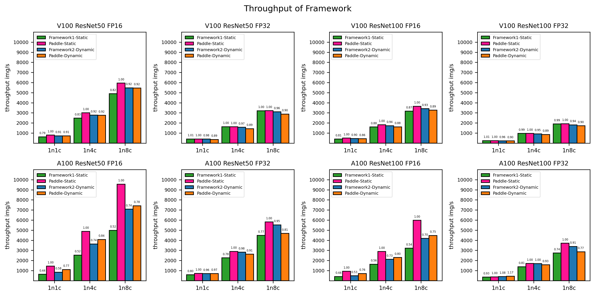

# PLSC (Paddle Large Scale Classification)

## 1. Introduction

[PLSC](https://github.com/PaddlePaddle/PLSC) is an open source repo for a collection of Paddle Large Scale Classification Tools, which supports 92 million classes on a single node with 8 NVIDIA V100 (32G) GPUs and has high training throughtput. It implements [ArcFace](https://arxiv.org/abs/1801.07698), [CosFace](https://arxiv.org/abs/1801.09414), [PartialFC](https://arxiv.org/abs/2010.05222), SparseMomentum, DataParallel + ModelParallel distributed training, FP16 training.

## 2. Top News

**Update (2022-01-11):** Supported NHWC data format of FP16 to improve 10% throughtput and decreased 30% GPU memory. It supported 92 million classes on single node 8 NVIDIA V100 (32G) and has high training throughtput. Supported best checkpoint save. And we released 18 pretrained models and PLSC v2.2.

**Update (2021-12-11):** Released [Zhihu Technical Artical](https://zhuanlan.zhihu.com/p/443091282) and [Bilibili Open Class](https://www.bilibili.com/video/BV1VP4y1G73X)

**Update (2021-10-10):** Added FP16 training, improved throughtput and optimized GPU memory. It supported 60 million classes on single node 8 NVIDIA V100 (32G) and has high training throughtput.

**Update (2021-09-10):** This repository supported both ``static`` mode and ``dynamic`` mode to use paddlepaddle v2.2, which supported 48 million classes on single node 8 NVIDIA V100 (32G). It added [PartialFC](https://arxiv.org/abs/2010.05222), SparseMomentum, and [ArcFace](https://arxiv.org/abs/1801.07698), [CosFace](https://arxiv.org/abs/1801.09414) (we refer to MarginLoss). Backbone includes IResNet and MobileNet.


## 3. Environment Preparation

### 3.1 Install Paddle from PyPI

```shell
# python required 3.7
# paddlepaddle required 2.2.2
pip install paddlepaddle-gpu==2.2.2.post112
```

### 3.2 Install Paddle from Source Code

For more install information, ref to [PaddlePaddle](https://www.paddlepaddle.org.cn/)

```shell

git clone https://github.com/PaddlePaddle/Paddle.git

cd /path/to/Paddle/

git checkout -b release/2.2 upstream/release/2.2

mkdir build && cd build

cmake .. -DWITH_TESTING=ON -DWITH_GPU=ON -DWITH_GOLANG=OFF -DWITH_STYLE_CHECK=ON -DCMAKE_INSTALL_PREFIX=$PWD/output -DWITH_DISTRIBUTE=ON -DCMAKE_BUILD_TYPE=Release -DPY_VERSION=3.7 -DCUDA_ARCH_NAME=All -DPADDLE_VERSION=2.2.2

make -j20 && make install -j20

pip install output/opt/paddle/share/wheels/paddlepaddle_gpu-2.2.2-cp37-cp37m-linux_x86_64.whl

```


### 3.3 Download PLSC

```shell
git clone https://github.com/PaddlePaddle/PLSC.git

cd /path/to/PLSC/
```


## 4. Data Preparation

### 4.1 Download Dataset

Download the dataset from [insightface datasets](https://github.com/deepinsight/insightface/tree/master/recognition/_datasets_).

* MS1M_v2: MS1M-ArcFace
* MS1M_v3: MS1M-RetinaFace

### 4.2 Extract MXNet Dataset to Images

```shell
python tools/mx_recordio_2_images.py --root_dir ms1m-retinaface-t1/ --output_dir MS1M_v3/
```

After finishing unzipping the dataset, the folder structure is as follows.

```
MS1M_v3
|_ images
|  |_ 00000001.jpg
|  |_ ...
|  |_ 05179510.jpg
|_ label.txt
|_ agedb_30.bin
|_ cfp_ff.bin
|_ cfp_fp.bin
|_ lfw.bin
```

Label file format is as follows.

```
# delimiter: "\t"
# the following the content of label.txt
images/00000001.jpg 0
...
```

If you want to use customed dataset, you can arrange your data according to the above format. 

## 5. How to Training


### 5.1 Single Node, 8 GPUs:

#### Static Mode

```bash
sh scripts/train_static.sh
```

#### Dynamic Mode

```bash
sh scripts/train_dynamic.sh
```

### 5.2 Single Node, 1 GPU:

Modify the ``CUDA_VISIBLE_DEVICES`` environment variable.

``` bash
TRAINER_IP_LIST=127.0.0.1
CUDA_VISIBLE_DEVICES=3
```

### 5.3 Multi Node, Multi GPUs:

Modify the ``TRAINER_IP_LIST`` and ``CUDA_VISIBLE_DEVICES`` environment variable and then run the training shell script on each node.

``` bash
TRAINER_IP_LIST=10.11.12.1,10.11.12.2
CUDA_VISIBLE_DEVICES=0,1,2,3
```


## 6. Model Evaluation

The model evaluation process can be started as follows.

#### Static Mode

```bash
sh scripts/validation_static.sh
```

#### Dynamic Mode

```bash
sh scripts/validation_dynamic.sh
```

## 7. Export Model
PaddlePaddle supports inference using prediction engines. Firstly, you should export inference model.

#### Static Mode

```bash
sh scripts/export_static.sh
```

#### Dynamic Mode

```bash
sh scripts/export_dynamic.sh
```

We also support export to onnx model, you only need to set `--export_type onnx`.

## 8. Model Inference

The model inference process supports paddle save inference model and onnx model.

```bash
sh scripts/inference.sh
```

## 9. Model Performance

### 9.1 Accuracy on Verification Datasets

**Configuration：**
  * GPU: 8 NVIDIA Tesla V100 32G
  * BatchSize: 128/1024

| Mode    | Datasets | Backbone      | Precision | DataFormat | Ratio | agedb30 | cfp_fp  | lfw     | checkpoint&log                                               |
| ------- | :------: | :------------ | --------- | ---------- | ----- | ------- | ------- | :------ | :----------------------------------------------------------- |
| Static  |  MS1MV3  | Res50         | FP16      | NHWC       | 0.1   | 0.98200 | 0.98943 | 0.99850 | [download](https://plsc.bj.bcebos.com/pretrained_model/MS1M_v3_arcface_Res50_static_0.1_NHWC_FP16_v2.2.tgz) |
| Static  |  MS1MV3  | Res50         | FP32      | NCHW       | 0.1   | 0.98267 | 0.98986 | 0.99850 | [download](https://plsc.bj.bcebos.com/pretrained_model/MS1M_v3_arcface_Res50_static_0.1_NCHW_FP32_v2.2.tgz) |
| Static  |  MS1MV3  | Res50         | FP16      | NHWC       | 1.0   | 0.98300 | 0.98929 | 0.99850 | [download](https://plsc.bj.bcebos.com/pretrained_model/MS1M_v3_arcface_Res50_static_1.0_NHWC_FP16_v2.2.tgz) |
| Static  |  MS1MV3  | Res50         | FP32      | NCHW       | 1.0   | 0.98400 | 0.98929 | 0.99833 | [download](https://plsc.bj.bcebos.com/pretrained_model/MS1M_v3_arcface_Res50_static_1.0_NCHW_FP32_v2.2.tgz) |
| Static  |  MS1MV3  | Res100        | FP16      | NHWC       | 0.1   | 0.98383 | 0.99200 | 0.99850 | [download](https://plsc.bj.bcebos.com/pretrained_model/MS1M_v3_arcface_Res100_static_0.1_NHWC_FP16_v2.2.tgz) |
| Static  |  MS1MV3  | Res100        | FP32      | NCHW       | 0.1   | 0.98317 | 0.99157 | 0.99850 | [download](https://plsc.bj.bcebos.com/pretrained_model/MS1M_v3_arcface_Res100_static_0.1_NCHW_FP32_v2.2.tgz) |
| Static  |  MS1MV3  | Res100        | FP16      | NHWC       | 1.0   | 0.98367 | 0.99086 | 0.99867 | [download](https://plsc.bj.bcebos.com/pretrained_model/MS1M_v3_arcface_Res100_static_1.0_NHWC_FP16_v2.2.tgz) |
| Static  |  MS1MV3  | Res100        | FP32      | NCHW       | 1.0   | 0.98417 | 0.99129 | 0.99867 | [download](https://plsc.bj.bcebos.com/pretrained_model/MS1M_v3_arcface_Res100_static_1.0_NCHW_FP32_v2.2.tgz) |
| Dynamic |  MS1MV3  | Res50         | FP16      | NHWC       | 0.1   | 0.98367 | 0.99029 | 0.99850 | [download](https://plsc.bj.bcebos.com/pretrained_model/MS1M_v3_arcface_Res50_dynamic_0.1_NHWC_FP16_v2.2.tgz) |
| Dynamic |  MS1MV3  | Res50         | FP32      | NCHW       | 0.1   | 0.98400 | 0.98986 | 0.99867 | [download](https://plsc.bj.bcebos.com/pretrained_model/MS1M_v3_arcface_Res50_dynamic_0.1_NCHW_FP32_v2.2.tgz) |
| Dynamic |  MS1MV3  | Res50         | FP16      | NHWC       | 1.0   | 0.98317 | 0.98971 | 0.99850 | [download](https://plsc.bj.bcebos.com/pretrained_model/MS1M_v3_arcface_Res50_dynamic_1.0_NHWC_FP16_v2.2.tgz) |
| Dynamic |  MS1MV3  | Res50         | FP32      | NCHW       | 1.0   | 0.98350 | 0.99000 | 0.99850 | [download](https://plsc.bj.bcebos.com/pretrained_model/MS1M_v3_arcface_Res50_dynamic_1.0_NCHW_FP32_v2.2.tgz) |
| Dynamic |  MS1MV3  | Res100        | FP16      | NHWC       | 0.1   | 0.98500 | 0.99143 | 0.99867 | [download](https://plsc.bj.bcebos.com/pretrained_model/MS1M_v3_arcface_Res100_dynamic_0.1_NHWC_FP16_v2.2.tgz) |
| Dynamic |  MS1MV3  | Res100        | FP32      | NCHW       | 0.1   | 0.98383 | 0.99114 | 0.99867 | [download](https://plsc.bj.bcebos.com/pretrained_model/MS1M_v3_arcface_Res100_dynamic_0.1_NCHW_FP32_v2.2.tgz) |
| Dynamic |  MS1MV3  | Res100        | FP16      | NHWC       | 1.0   | 0.98500 | 0.99214 | 0.99883 | [download](https://plsc.bj.bcebos.com/pretrained_model/MS1M_v3_arcface_Res100_dynamic_1.0_NHWC_FP16_v2.2.tgz) |
| Dynamic |  MS1MV3  | Res100        | FP32      | NCHW       | 1.0   | 0.98400 | 0.99100 | 0.99850 | [download](https://plsc.bj.bcebos.com/pretrained_model/MS1M_v3_arcface_Res100_dynamic_1.0_NCHW_FP32_v2.2.tgz) |
| Dynamic |  MS1MV3  | MobileFaceNet | FP32      | NCHW       | 0.1   | 0.96200 | 0.96571 | 0.99567 | [download](https://plsc.bj.bcebos.com/pretrained_model/MS1M_v3_arcface_MobileFaceNet_dynamic_0.1_NCHW_FP32_v2.2.tgz) |
| Dynamic |  MS1MV3  | MobileFaceNet | FP32      | NCHW       | 1.0   | 0.96167 | 0.96657 | 0.99533 | [download](https://plsc.bj.bcebos.com/pretrained_model/MS1M_v3_arcface_MobileFaceNet_dynamic_1.0_NCHW_FP32_v2.2.tgz) |

  
### 9.2 Maximum Number of Identities 

#### Static Mode

```bash
sh scripts/find_maximum_classes_static.sh
```

#### Dynamic Mode

```bash
sh scripts/find_maximum_classes_dynamic.sh
```

**Configuration：**
  * GPU: 8 NVIDIA Tesla V100 32G (32510MiB)
  * BatchSize: 64/512
  * SampleRatio: 0.1

| Mode                      | Precision | Res50              | Res100             |
| ------------------------- | --------- | ------------------ | ------------------ |
| Framework1 (static)       | AMP       | 42000000 (31792MiB)| 39000000 (31938MiB)|
| Framework2 (dynamic)      | AMP       | 30000000 (31702MiB)| 29000000 (32286MiB)|
| Paddle (static)           | FP16      | 92000000 (32298MiB)| 88000000 (32298MiB)|
| Paddle (dynamic)          | FP16      | 87000000 (31978MiB)| 84000000 (31978MiB)|


### 9.3 Throughtput

**Configuration：**
  * BatchSize: 128/1024
  * SampleRatio: 0.1
  * Datasets: MS1MV3
  


**Note:** please click the image to see high-definition image.

## 10. Demo

Combined with face detection model, we can complete the face recognition process.
**Note: We only show a demo which can not be use to commercial application.**

Firstly, use the fllowing commands to download the models.

```bash
# Create models directory
mkdir -p models

# Download blazeface face detection model and extract it
wget https://paddle-model-ecology.bj.bcebos.com/model/insight-face/blazeface_fpn_ssh_1000e_v1.0_infer.tar -P models/
tar -xzf models/blazeface_fpn_ssh_1000e_v1.0_infer.tar -C models/
rm -rf models/blazeface_fpn_ssh_1000e_v1.0_infer.tar

# Download dynamic ResNet50 PartialFC 0.1 model and extract it
wget https://plsc.bj.bcebos.com/pretrained_model/MS1M_v3_arcface_Res50_dynamic_0.1_NHWC_FP16_v2.2.tgz -P models/
tar -xzf models/MS1M_v3_arcface_Res50_dynamic_0.1_NHWC_FP16_v2.2.tgz -C models/

# Export dynamic save inference model using cfp_fp best model
python tools/export.py --is_static False --export_type paddle --backbone FresResNet50 --embedding_size 512 --checkpoint_dir models/MS1M_v3_arcface_Res50_dynamic_0.1_NHWC_FP16_v2.2/FresResNet50/best_model/cfp_fp/ --output_dir models/MS1M_v3_arcface_Res50_dynamic_0.1_NHWC_FP16_v2.2_infer
```

Then, use the following commands to download the gallery, demo image and font file for visualization. And we generate gallery features.

```bash
mkdir -p images/

# Download gallery, query
wget https://plsc.bj.bcebos.com/Friends.tgz -P images/
tar -xzf images/Friends.tgz -C images/

# Download font file
mkdir -p assets
wget https://plsc.bj.bcebos.com/SourceHanSansCN-Medium.otf -P assets/

# Build index file
python tools/test_recognition.py \
    --rec \
    --rec_model_file_path models/MS1M_v3_arcface_Res50_dynamic_0.1_NHWC_FP16_v2.2_infer/FresResNet50.pdmodel \
    --rec_params_file_path models/MS1M_v3_arcface_Res50_dynamic_0.1_NHWC_FP16_v2.2_infer/FresResNet50.pdiparams \
    --build_index=images/Friends/gallery/index.bin \
    --img_dir=images/Friends/gallery \
    --label=images/Friends/gallery/label.txt
```

Use the following command to run the whole face recognition demo.

```bash
# detection + recogniotion process
python tools/test_recognition.py \
    --det \
    --det_model_file_path models/blazeface_fpn_ssh_1000e_v1.0_infer/inference.pdmodel \
    --det_params_file_path models/blazeface_fpn_ssh_1000e_v1.0_infer/inference.pdiparams \
    --rec \
    --rec_model_file_path models/MS1M_v3_arcface_Res50_dynamic_0.1_NHWC_FP16_v2.2_infer/FresResNet50.pdmodel \
    --rec_params_file_path models/MS1M_v3_arcface_Res50_dynamic_0.1_NHWC_FP16_v2.2_infer/FresResNet50.pdiparams \
    --index=images/Friends/gallery/index.bin \
    --input=images/Friends/query/friends2.jpg \
    --cdd_num 10 \
    --output="./output"
```

The final result is save in folder `output/`, which is shown as follows. **Note:** the recognition threshold is different according recognition model. Since we do not use landmark detection to align the face, the threshold is lower.

<div align="center">

</div>
